# GATK Best Practice on AWS

* [Summary](#Summary)
* [Features](#Features)
* [Solutions](#Solutions)
    * [Cluster Solution](#Cluster-Solution)
    * [End-to-end Solution](#End-to-end-Solution)
* [Migration Guide](#Migration-Guide)
* [Quick Start](#Quick-Start)
    * [Cluster](#10-Minutes-Cluster-Building)
      * [Install awscli & pip](#Install-awscli-&-pip)
      * [Install pcluster](#Install-pcluster)
      * [Config pcluster](#Config-pcluster)
      * [Launch Cluster](#Launch-Cluster)
      * [SSH to Master Node](#SSH-to-Master-Node)
      * [Submit Task](#Submit-Task)
    * [AMI](#ami)
    * [DEMO](#demo)
* [Reference：](#Reference)
* [FAQ](#faq)


## Summary

The analysis platform of the current genetic industry can roughly divided into three categories: Single node, server based cluster(classic HPC cluster), and docker based cluster(Kubernetes cluster). Most of the analysis applications are still built on the classic on-premise HPC cluster and many of them are on-premise. 

But on-premise HPC may encounter the following challenges:

+ There will need **several months** to build **one cluster**. It's too long to keep up with business.
+ It's hard to **operate** and achieve **high availability** for the cluster.
+ It's hard to take **data life-cycle management**.
+ It's are difficult to **control resources accurately**.
+ ...

In addition to this, there are many challenges that will bother you. In order to help overcome and solve these challenges, we have designed a turn key solution that can create a complete HPC cluster with one click. It is also possible to enable local users to build in the life sciences by replicating the template and minimizing the cost of local testing, migration, and clustering on the cloud. A safe, reliable, efficient, and low-cost HPC clusters can liberate the developer and operator from trivial matters and let them focus on more creative things.

The core service of this solution is [AWS ParallelCluster](https://aws.amazon.com/blogs/opensource/aws-parallelcluster/), which comes with jobwatcher and can monitor the SGE, Slurm or Torque operation every minute to determine when the node need elastically stretched. It can directly bring about 30% cost savings.

More About AWS ParallelCluster, you can reference ***[AWS ParallelCluster user guide](https://docs.aws.amazon.com/parallelcluster/latest/ug/processes.html).***


***

## Features

Which situation can we solve：
+ Production and testing environment in **one** cluster.
+ NO DR.
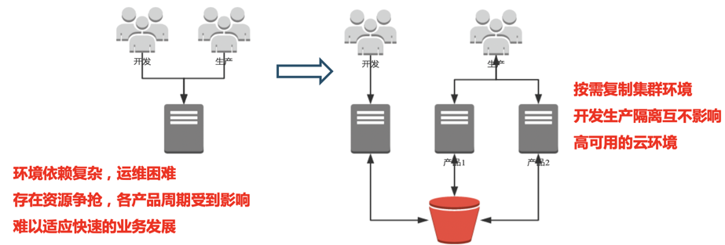

+ It is difficult to calculate the resources.
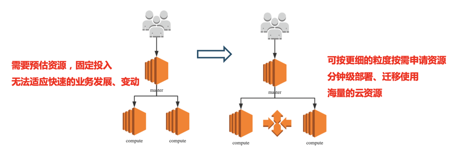

+ Cluster operation need many operator, and no version control. 
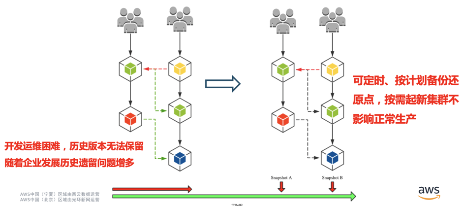

+ Other challenges of industry:
  + Project management relies on manual tracking, no information system or low degree of informationization
  + It's hard to calculate the cost in the whole pipeline.
  + Data is very huge and complex. It's difficult to achieve life-cycle management

***

## Solutions
### Cluster Solution
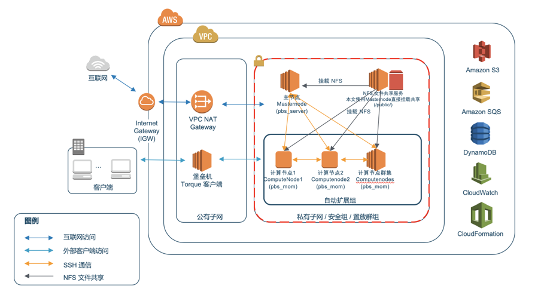
### End-to-end Solution
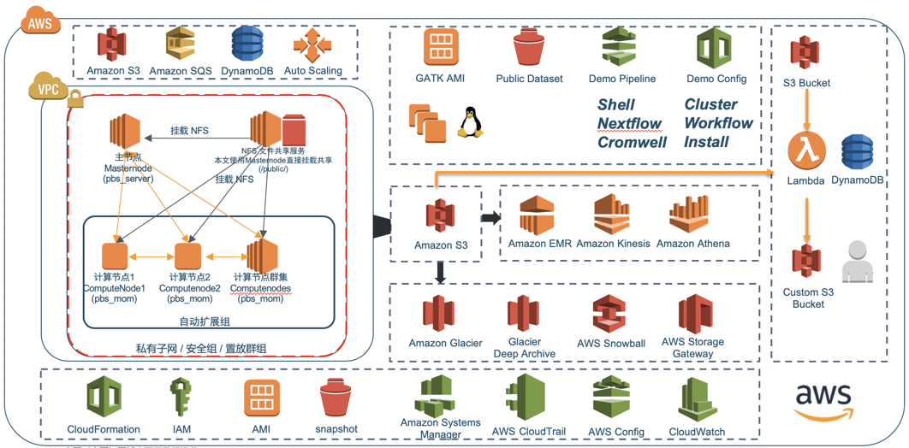
## Migration Guide
[Migration Guide](doc/01.migrate/README.md)
## Quick Start
### Cluster
This guide will lead you to build a complete cluster, include master node, compute node, shared storage and SGE which the task schduler. The AMI will contain GATK ralated tools, such bwa, Samtools gatk4 and so on. The GATK public database and other testing data have been stored on the snapshot, and you can mount on the `/genomics` folder when the cluster have bee created.

***[p.s.：This guide is based on Ninxia region, and needs several access in your account(you can use `admin access` at first try)](https://docs.aws.amazon.com/parallelcluster/latest/ug/iam.html)***

#### Install awscli & pip

+ [Install awscli](https://docs.aws.amazon.com/zh_cn/cli/latest/userguide/cli-chap-install.html)
+ aws_access_key_id及aws_secret_access_key


**Open the console website, and click *My Security Credencials***

**Create and save aws_access_key_id and aws_secret_access_key**

<br>

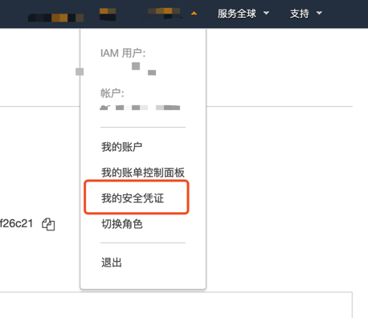

<br>

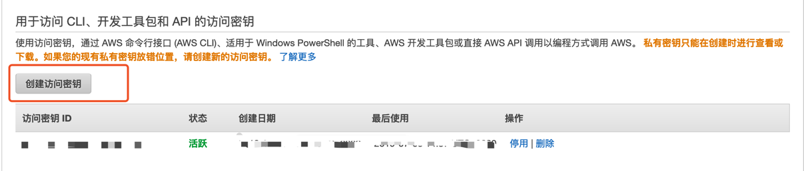

<br>
<br>

```shell
#Install pip
curl https://bootstrap.pypa.io/get-pip.py -o get-pip.py
python get-pip.py

#Install awscli
sudo pip install awscli

#Config awscli
#set AK, SK, region and outpu type
aws configure 
```
#### Install pcluster
```shell
sudo pip install aws-parallelcluster
```

#### Config pcluster
##### Preparation

+ VPC

**Assigning or creating a VPC and subnet from VPC console, and recording the vpc_id, master_subnet_id**

<br>

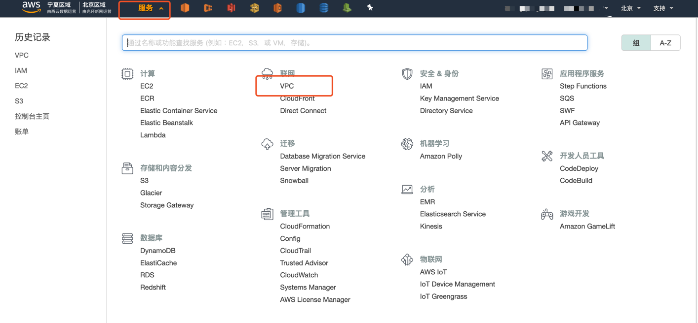

<br>

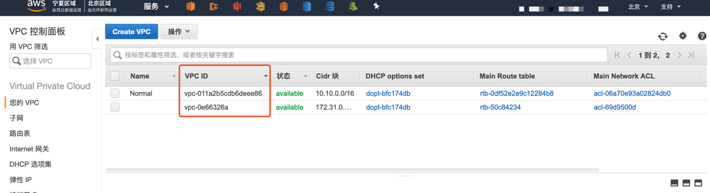

<br>

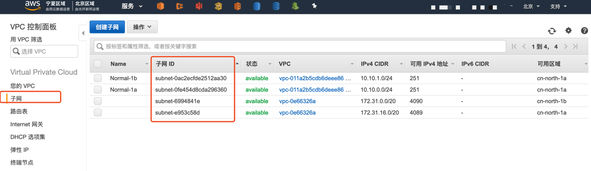

<br>
<br>

+ EC2 key pair

**Assigning or creating a key pair on the [console](https://cn-northwest-1.console.amazonaws.cn/console/home?region=cn-northwest-1#), and recording the name**

<br>

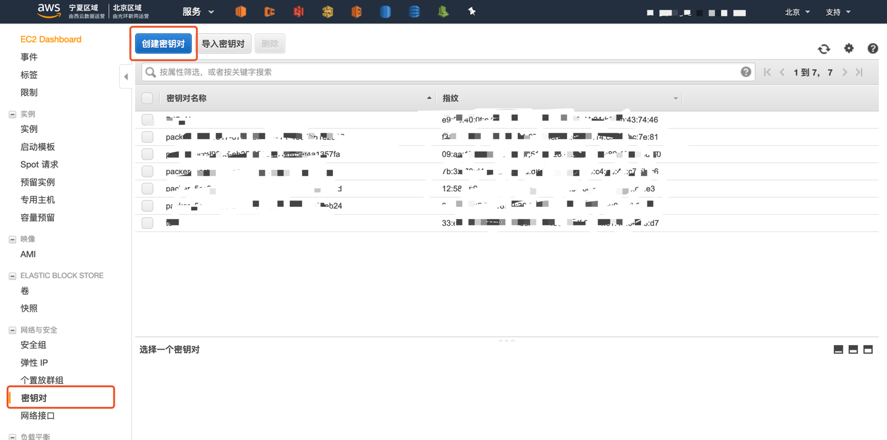

##### ②、pcluster config([reference blog](https://docs.aws.amazon.com/zh_cn/parallelcluster/latest/ug/configuration.html))

```shell
#Create a config template
pcluster create new

#Use vim to edit
vim ~/.parallelcluster/config

#Copy the content below, and paste to your ~/.parallelcluster/config`
[aws]
aws_region_name = cn-northwest-1

[global]
update_check = true
sanity_check = true
cluster_template = GATK-pipeline

[aliases]
ssh = ssh {CFN_USER}@{MASTER_IP} {ARGS}

[cluster GATK-pipeline]
base_os = alinux
custom_ami = ami-005db8a58ebd4e9a4 #Modify as needed
vpc_settings = public
scheduler = slurm
key_name = ZHY_key  #Need to modify
compute_instance_type = m5.xlarge
master_instance_type = m5.xlarge
compute_root_volume_size = 50
master_root_volume_size = 50
ebs_settings = genomes
scaling_settings = GATK-ASG
initial_queue_size = 1
max_queue_size = 4
maintain_initial_size = false
extra_json = { "cluster" : { "cfn_scheduler_slots" : "cores" } }

[vpc public]
vpc_id = vpc-a817aac5  #Need to modify
master_subnet_id = subnet-26fcc86cd  #Need to modify

[ebs genomes]
shared_dir = genomes
ebs_snapshot_id = snap-040c71fd2bb5d4236 #Modify as needed
volume_type = gp2
volume_size =  1024

[scaling GATK-ASG]
scaledown_idletime = 5
```
    
#### Launch Cluster
```shell
pcluster create GATK-pipeline
```
    
#### SSH to Master Node
```shell
#You can find the login info after the cluster have launched
#ssh -i <private key_name> <username>@<public ip>
ssh -i <private key_name> ec2-user@master-public-ip #alinux
ssh -i <private key_name> ubuntu@master-public-ip #ubuntu
ssh -i <private key_name> centos@master-public-ip #centos
```
    
#### Submit Sample Task
SGE sample:
```
echo "sleep 180" | qsub
echo "sh run.sh" | qsub -l vf=2G,s_core=1 -q all.q
for((i=1;i<=10;i++));do echo "sh /genomes/temp/run.sh $i" | qsub -cwd -S /bin/bash -l vf=2G,s_core=1 -q all.q;done
```    

SLURM sample：
```shell
sbatch -n 4 run.sh  #4 physical cores
squeue
sinfo
scancel jobid
```

PBS sample：
```shell
echo "sleep 180" | qsub
echo "sh run.sh" | qsub -l nodes=1,walltime=2:00:00,mem=2gb -q batch
for((i=1;i<=10;i++));do echo "sh /genomes/temp/run.sh $i" | qsub -l nodes=1,walltime=2:00:00,mem=2gb -q batch;done
```

### AMI
***p.s. You can customize your own ami by offcial document***

+ [alinux](https://github.com/lab798/GATK-Best-Practice-on-AWS/tree/master/AMI/alinux.sh)
+ [ubuntu](https://github.com/lab798/GATK-Best-Practice-on-AWS/tree/master/AMI/ubuntu.sh)

### DEMO

+ [nextflow based demo](https://github.com/lab798/GATK-Best-Practice-on-AWS/tree/master/example/nextflow/README.md)
+ [cromwell based demo](https://github.com/lab798/GATK-Best-Practice-on-AWS/tree/master/example/cromwell/README.md)
+ [shell based demo](https://github.com/lab798/GATK-Best-Practice-on-AWS/tree/master/example/shell/README.md)


## Reference：

+ [AWS ParallelCluster Blog](https://aws.amazon.com/cn/blogs/opensource/aws-parallelcluster/)
+ [AWS ParallelCluster Document](https://docs.aws.amazon.com/parallelcluster/latest/ug/what-is-aws-parallelcluster.html)
+ [aws-parallelcluster GitHub repository](https://github.com/aws/aws-parallelcluster)
+ AMI Version

|System	|Version	|pcluster version	|AMI ID	|Describe|Region	|Public	|Available	|Remark	|
|---	|---	|---	|---	|---	|---	|---	|---	|---	|
|alinux-base	|	|2.3.1	|ami-0e58e06d5b958ccb6	|basic AMI	|BJS	|Y	|Y	|	|
|ubuntu-base	|16.04	|2.3.1	|ami-0a9c1879e6583621e	|basic AMI|BJS	|Y	|Y	|	|
|alinux	|0.1	|2.3.1	|ami-0997595bce93c6e7b	|basic tools	|BJS	|Y	|Y	|	|
|alinux	|0.2	|2.3.1	|ami-0cad4e9d804bd9c15	|basic tools + Golang tool + goofys; fixed pip issue;installed awscli; fixed issue that can not mount goofys, and install fuse depands lib  |BJS	|Y	|Y	|	|
|alinux	|0.2	|2.4.0	|ami-0b876120ec98b9a7c	|basic tools	|BJS	|Y	|Y	|	|
|ubuntu	|0.1	|2.3.1	|ami-097d3bf901991372e	|basic tools	|BJS	|Y	|Y	|	|
|ubuntu	|0.2	|2.3.1	|ami-041e4a3bce09385b9	|change shell(dash) to bash	|BJS	|Y	|Y	|stoped update	|
|ubuntu	|0.2-a	|2.3.1	|ami-026882b56146cdc1b	|basic tools + Golang tool + goofys	|BJS	|Y	|Y	|	|
|alinux	|0.1	|2.3.1	|ami-007f6ed61542ae017	|basic tools	|ZHY	|Y	|Y	|	|
|alinux	|0.2	|2.4.0	|ami-005db8a58ebd4e9a4	|basic tools	|ZHY	|Y	|Y	|	|
|ubuntu	|0.1	|2.3.1	|ami-0a1d99c2c70e3f86c	|basic tools	|ZHY	|Y	|N	|	|
|ubuntu	|0.2	|2.3.1	|ami-071aa7a2927cc02a8	|changed shell(dash) to bash	|ZHY	|Y	|N	|stoped update	|
|ubuntu	|0.2-a	|2.3.1	|ami-015f3a018cc98b6cc	|basic tools + Golang tool + goofys	|ZHY	|Y	|N	|	|

•   EBS snapshot version：

|Name	|Version|snap ID	|Size	|describe	|Region	|
|---	|---	|---	|---	|---	|---	|
|gatk-reference v0.1	|0.1	|snap-09c16ac9809cf4359	|100G	|basic tools snapshot, including hg19 database	|BJS	|
|gatk-reference v0.2	|0.2	|snap-06f5e874571e44510	|100G	|added hg38 and GATK data base	|BJS	|
|gatk-reference-v0.3	|0.3	|snap-08a4b975a2f40736f	|1T	|added testing files and GATK-TEST-DATA	|BJS	|
|gatk-reference-v0.3	|0.3	|snap-040c71fd2bb5d4236	|1T	|added testing files and GATK-TEST-DATA	|ZHY	|
|	|	|	|	|	|	|

## FAQ

